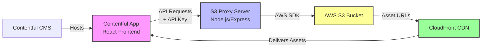

# S3 Contentful App

A Contentful app that allows browsing and selecting assets from an S3 bucket through a secure proxy server.

> **Disclaimer:** This code is provided as-is for use as a reference implementation. It is not officially supported by Contentful. Use at your own discretion and modify as needed for your specific requirements.

## Architecture



### How It Works

1. **Contentful App** (Frontend) runs inside Contentful's CMS interface
2. User browses folders/files through the React UI
3. **App makes authenticated requests** to the S3 Proxy Server using API Key
4. **S3 Proxy Server** validates the API key and fetches data from S3 using AWS SDK
5. **S3 objects are listed** and their URLs are generated using the CloudFront domain
6. **Assets are delivered** through CloudFront CDN for optimal performance

### Why a Proxy Server?

The proxy server is essential for security and functionality:

1. **AWS Credentials Protection** - AWS access keys never reach the browser. The frontend only knows a simple API key, while sensitive AWS credentials remain safely on the server.

2. **Single API Key** - Instead of embedding AWS credentials in the Contentful app (where they could be exposed), you only pass a single revocable API key that has limited permissions.

3. **CORS Handling** - The proxy server properly handles CORS headers, allowing the Contentful app to make cross-origin requests. Direct browser-to-S3 requests would be blocked by CORS policies.

4. **Request Control** - The proxy can implement rate limiting, request validation, and logging - giving you control over how S3 is accessed.

5. **Abstraction Layer** - If you need to change S3 buckets, AWS accounts, or even switch cloud providers, you only update the proxy server without touching the Contentful app.

6. **No Client-Side AWS SDK** - Avoids bundling the large AWS SDK in your frontend, keeping the app lightweight.

## Project Structure

```
contentful-app/     - Contentful app frontend (React + Vite)
s3-proxy/          - Node.js proxy server for S3 API
```

## Setup

### 1. S3 Proxy Server Setup

#### Install Dependencies

```bash
cd s3-proxy
npm install
```

#### Configure Environment Variables

Create a `.env` file in the `s3-proxy` directory:

```bash
cd s3-proxy
# Edit .env and fill in all values
```

Required environment variables:

```env
# Server Configuration
PORT=5284
NODE_ENV=development

# API Key for Contentful App Authentication
API_KEY=

# AWS Configuration
AWS_REGION=
AWS_ACCESS_KEY_ID=
AWS_SECRET_ACCESS_KEY=

# S3 Configuration
S3_BUCKET_NAME=

# CloudFront Configuration
CLOUDFRONT_DOMAIN=
```

#### Where to Find AWS Values

**API_KEY** - Generate a secure random key:

```bash
node -e "console.log(require('crypto').randomBytes(32).toString('hex'))"
```

**AWS_REGION** - Find in AWS S3 Console next to your bucket (e.g., `us-east-1`)

**AWS_ACCESS_KEY_ID & AWS_SECRET_ACCESS_KEY**:

1. Go to **IAM** → **Users** in AWS Console
2. Select your user (or create new user)
3. Go to **Security credentials** tab
4. Click **Create access key**
5. Choose **Application running outside AWS**
6. Save both the Access Key ID and Secret Access Key

**Recommended IAM Policy** for the user:

```json
{
  "Version": "2012-10-17",
  "Statement": [
    {
      "Effect": "Allow",
      "Action": ["s3:ListBucket", "s3:GetObject"],
      "Resource": [
        "arn:aws:s3:::YOUR-BUCKET-NAME",
        "arn:aws:s3:::YOUR-BUCKET-NAME/*"
      ]
    }
  ]
}
```

**S3_BUCKET_NAME** - Your S3 bucket name from AWS S3 Console

**CLOUDFRONT_DOMAIN** - Your CloudFront distribution domain (e.g., `d1234567890abc.cloudfront.net`)

#### CloudFront Setup

**Why CloudFront is Required:**

CloudFront provides critical security benefits:

1. **Prevents Direct S3 Access** - With Origin Access Control (OAC), your S3 bucket can be configured to deny all direct public access. Only CloudFront can access the bucket, preventing anyone from bypassing your proxy server by guessing S3 URLs.

2. **Private S3 Buckets** - Your S3 bucket remains completely private. Even if someone discovers your bucket name, they cannot access any files directly. All access must go through CloudFront, which only CloudFront (via OAC) can reach.

3. **HTTPS Enforcement** - CloudFront enforces HTTPS for all asset delivery, ensuring encrypted connections for all media files.

4. **Geo-Restrictions** - CloudFront allows you to restrict content delivery by geographic location if needed.

5. **DDoS Protection** - CloudFront provides built-in AWS Shield Standard protection against DDoS attacks.

**Setup Steps:**

1. Go to **CloudFront** in AWS Console
2. Click **Create Distribution**
3. **Origin Settings**:
   - **Origin Domain**: Select your S3 bucket
   - **Origin Access**: Choose "Origin Access Control settings (recommended)"
   - Create new control setting if needed
4. **Default Cache Behavior**:
   - **Viewer Protocol Policy**: Redirect HTTP to HTTPS
   - **Allowed HTTP Methods**: GET, HEAD
   - **Cache Policy**: CachingOptimized
   - **Origin Request Policy**: CORS-S3Origin
5. Click **Create Distribution**
6. Wait for deployment (5-10 minutes)
7. **Update S3 Bucket Policy**:
   - Copy the policy shown in CloudFront
   - Apply it to your S3 bucket under Permissions → Bucket Policy
8. Copy the **Distribution Domain Name** for your `.env` file

#### Start the Server

```bash
cd s3-proxy
npm start
```

You should see:

```
🚀 S3 Proxy Server running at: http://localhost:5284
```

#### Test the Server

**Quick Health Check:**

```bash
curl http://localhost:5284/health
```

Expected: `{"status":"ok","service":"s3-proxy"}`

**Test S3 Endpoints:**

```bash
# Replace YOUR_API_KEY with your actual API key from .env
curl -H "x-api-key: YOUR_API_KEY" http://localhost:5284/api/s3/prefixes
```

**Run Full Test Suite:**

```bash
chmod +x test-endpoints.sh
API_KEY=your-actual-api-key ./test-endpoints.sh
```

See [s3-proxy/TEST_GUIDE.md](s3-proxy/TEST_GUIDE.md) for detailed testing instructions.

### 2. Contentful App Setup

#### Install Dependencies

```bash
cd contentful-app
npm install
```

#### Development

```bash
cd contentful-app
npm run dev
```

#### Build for Production

```bash
cd contentful-app
npm run build
```

The built files will be in `contentful-app/build/`.

#### Deploy to Contentful

1. Build the app: `npm run build`
2. In Contentful:
   - Go to **Apps** → **Manage Apps**
   - Create new app or edit existing
   - **Hosting Options:**
     - **Option A (Recommended): Host in Contentful** - Upload the `build/` folder contents directly using Contentful's app hosting (available for organization apps)
     - **Option B: External Hosting** - Host on a static hosting service (Netlify, Vercel, S3+CloudFront, etc.) and provide the URL
   - Configure installation parameters:
     - **Proxy URL**: `http://localhost:5284` (for development) or your deployed proxy URL (for production)
     - **API Key**: The same key from your proxy `.env` file
     - **CloudFront Domain**: Your CloudFront domain (without https://)
     - **Max Files**: Maximum number of files to allow selection (optional)

## Troubleshooting

### Server won't start

- Check all `.env` values are filled in
- Verify AWS credentials are correct
- Check port 5284 isn't already in use

### 500 errors on S3 endpoints

- Verify AWS credentials have S3 permissions
- Check S3 bucket name is correct
- Verify AWS region matches your bucket's region

### Empty results

- Make sure your S3 bucket has files in it
- Try searching for a filename you know exists
- Check CloudFront domain is correct (for asset URLs)

### CORS errors

- Make sure CloudFront is properly configured
- Verify the proxy server is running
- Check that the proxy URL in Contentful matches your server

## API Endpoints

The S3 proxy provides the following endpoints:

- `GET /health` - Health check (no auth required)
- `GET /api/s3/prefixes?prefix=path/` - List folders at a path
- `GET /api/s3/objects?prefix=path/&pageSize=25&continuationToken=token` - List files with pagination
- `GET /api/s3/search?q=searchterm&prefix=path/&pageSize=25` - Search for files

All `/api/s3/*` endpoints require the `x-api-key` header.

## License

MIT
